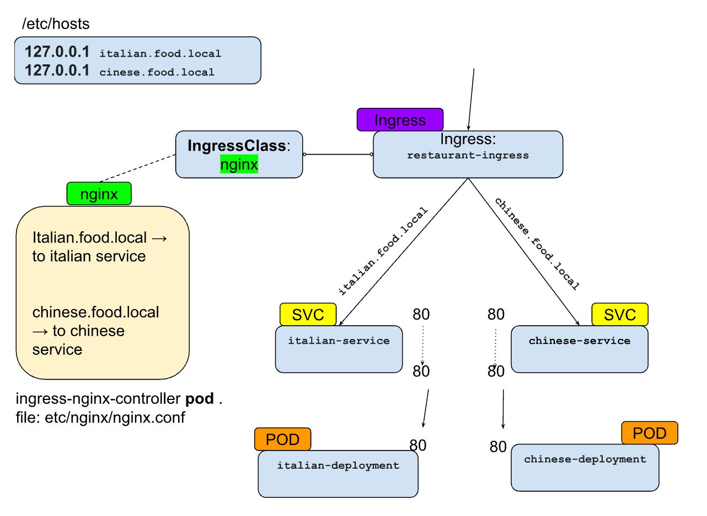

# Running the App

## Using Kubernetes with ECR Images
1. **Authenticate with ECR**
   ```bash
   aws ecr get-login-password --region <your-region> | docker login --username AWS --password-stdin <your-ecr-repository-url>
   ```
2. **Tag and Push Images to ECR**
   ```bash
   docker tag web-service:latest <your-ecr-repository-url>/<IMAGE>:<TAG>
   docker push <your-ecr-repository-url>/<IMAGE>:<TAG>
   ```
3. **Create Kubernetes Secret for ECR**
   ```bash
   kubectl create secret docker-registry ecr-secret \
       --docker-server=<your-ecr-repository-url> \
       --docker-username=AWS \
       --docker-password=$(aws ecr get-login-password --region <your-region>) \
       -n <name_space>
   ```
4. **Replace image name placeholder  "-AWSID-", in backend-deployment.yml & frontend-deployment.yml files**

5. **Apply Kubernetes Configuration Files**
   ```bash
   kubectl apply -f .
   ```
6. **Access the Application**  
   Retrieve the service URL:
   ```bash
   minikube service frontend-service -n <name_space>
   ```
   
---
   
## Using Docker Compose
1. **Clone the repository**  
   Download this repository to your local machine.
2. **Run the app with Docker Compose**  
   Navigate to the project directory where `docker-compose.yml` is located and execute:
   ```bash
   docker-compose up -d
   ```
3. **Access the application**  
   Open your browser and go to: [http://localhost:5001](http://localhost:5001)
4. **Stop the application**  
   To stop the running containers, execute:
   ```bash
   docker-compose down
   ```
---

## Using Kubernetes with Local Images 
1. **Load Local Docker Images into Minikube**
   ```bash
   minikube image load <IMAGE>:<TAG>
   ```
2. **Apply Kubernetes Configuration Files**
   ```bash
   kubectl apply -f .
   ```
3. **Access the Application**  
   Use the following command to retrieve the service URL:
   ```bash
   minikube service <service_name> -n <name_space>
   ```

# Using Ingress
1. **update host file**
   ```bash
   sudo nano /etc/hosts 
   ```
2. **creates external access to Ingress resources by assigning a local IP**
   ```bash
   minikube tunnel
   ```
3. **Access via the Browser**
   ```bash
   http://flask-app.my-domain.com
   ```

## Ingress Explanation Diagram


